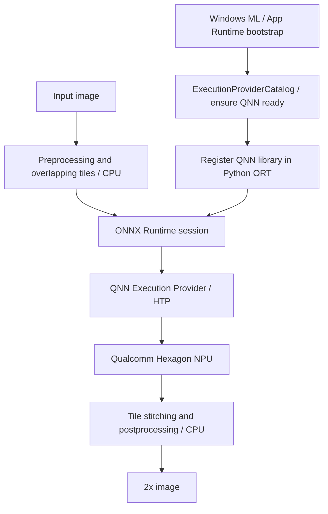

# npu-sr

> practical image and video enhancement on Qualcomm Hexagon NPUs.

[](https://github.com/AKMessi/npu-sr/actions/workflows/ci.yml)

**v0.1.0 supports single-image 2× super-resolution** on Snapdragon X Windows laptops,
using a small pretrained ESPCN model. **Video enhancement is planned and is not
implemented in this release.**

An NPU is a processor designed to run neural networks efficiently.
This project makes custom ONNX inference reproducible on Snapdragon laptops and
provides a CPU comparison for future work on video enhancement.

Snapdragon X Plus X1P-42-100 benchmark:

- CPU median inference: **8.5 ms**
- NPU median inference: **4.9 ms**
- NPU speedup: **1.73×**
- QNN execution verified; no CPU kernels in strict NPU profiling

These rounded measurements describe one machine, the included ESPCN model, and
the 256 × 160 test image, with 30 measured runs after five warmups. They are not
general Snapdragon performance claims. See the [benchmark JSON](benchmarks/snapdragon-x-plus.json)
and [measurement details](#benchmarks).

## Before / after

The original test card is generated by our own [example script](scripts/create_example.py).
It is intentionally simple: curves, edges, texture, and small text. View at native size.

| Low-resolution input (256 × 160) | Bicubic 2× | ESPCN 2×, QNN NPU |
| --- | --- | --- |
|  |  |  |

These are actual outputs from the tested laptop. This lightweight model sharpens
some edges, but can produce ringing and cannot reconstruct missing detail reliably.
It is an inference demonstration, with no claim of state-of-the-art image quality.

## Hardware

Target: Windows 11 ARM64 Snapdragon X Plus / X Elite laptops with a supported
Qualcomm Hexagon NPU and Windows 11 24H2 (build 26100) or newer. Other Snapdragon X
configurations need local validation. CPU mode can also run on Linux and macOS.

Tested locally on **2026-10-04**:

| Component | Verified configuration |
| --- | --- |
| Processor | Snapdragon X Plus X1P-42-100 |
| OS | Windows 11 ARM64, build 26200 |
| NPU driver | 30.0.219.1000 |
| Python | 3.12.0 ARM64 |
| ORT Windows ML package | 1.25.2.202605110140 (ORT API version 1.25.2) |
| Windows ML Python bindings | wasdk 2.3.0 |
| Installed App Runtime | 2.5.1.0 |
| QNN catalog package | 2.2480.53.0 |

The target laptop has a 45 TOPS NPU and 16 GB unified memory. TOPS is not a speed
prediction for this model; use the measured benchmark below.

## Prerequisites

1. Native **Python 3.12 ARM64** from python.org or winget, not Microsoft Store Python.
   Python 3.11–3.13 is allowed by package metadata; only 3.12 ARM64 was tested locally.
2. Windows App Runtime **2.x, version 2.3.0.0 or newer**, matching the pinned `wasdk`
   bindings. Install the **stable ARM64 runtime installer** from Microsoft's
   [official download page](https://learn.microsoft.com/en-us/windows/apps/windows-app-sdk/downloads).
   The validated installed version is 2.5.1.0. Run the installer normally;
   no Visual Studio, Windows SDK, Qualcomm SDK, or manually copied DLLs are needed.
3. Microsoft's [VC++ ARM64 redistributable](https://learn.microsoft.com/en-us/cpp/windows/latest-supported-vc-redist),
   and current OEM/Windows Update Qualcomm NPU drivers.
4. Internet access for pip, model acquisition, and the first Windows ML QNN installation.
   Image inference itself is local. Windows manages provider package servicing.

This follows Microsoft's [framework-dependent Python installation](https://learn.microsoft.com/en-us/windows/ai/new-windows-ml/distributing-your-app).
The Microsoft runtime has to be installed separately from pip's Python projections.

## Installation

Run in PowerShell after installing the prerequisites:

```powershell
git clone https://github.com/AKMessi/npu-sr.git
cd npu-sr
py -3.12-arm64 -m venv .venv
.venv\Scripts\Activate.ps1
python -m pip install --upgrade pip
python -m pip install -e .
python scripts/download_model.py
npu-sr doctor
```

The folder name may differ if you renamed the clone. If PowerShell blocks activation,
use `.venv\Scripts\python.exe` and `.venv\Scripts\npu-sr.exe` directly.
Do not install a second ONNX Runtime wheel into the same environment:
`onnxruntime`, `onnxruntime-qnn`, and `onnxruntime-windowsml` share an import namespace.
The package chooses Windows ML on Windows and standard CPU ORT on other OSes.

`models/` stays out of git. The acquisition script verifies the upstream SHA256,
exports ONNX without TensorFlow, and writes an adjacent integrity/provenance manifest.
Use `NPU_SR_MODEL_DIR` or `--model path\espcn-x2.onnx` if running outside the clone.
Without a clone-local models directory, the script uses `%LOCALAPPDATA%\npu-sr\models`
(or `~/.cache/npu-sr/models` on other OSes).

## Quickstart and CLI

```powershell
npu-sr upscale examples/input.png -o output.png --device npu
npu-sr upscale input.jpg -o output.png --device cpu
npu-sr upscale input.webp -o output.png --device auto
npu-sr upscale input.jpg -o output.png --device npu --verbose
npu-sr benchmark examples/input.png --runs 30 --json outputs/results.json
npu-sr upscale examples/input.png -o output.png --device npu --comparison-dir outputs/compare
npu-sr evaluate examples/input.png examples/reference.png --device npu
npu-sr --help
```

| Mode | Behavior |
| --- | --- |
| `npu` | Requires an explicit QNN NPU device, strict assignment, and a successful profiled proof run; failures exit nonzero |
| `cpu` | Uses only `CPUExecutionProvider` |
| `auto` (default) | Tries the same strict NPU path; reports `NPU unavailable — using CPU` if it cannot establish it |

Every upscale prints its selected backend, dimensions, inference time, startup time,
total time, and saved path. A failure during subsequent inference is an error;
the application does not switch backends midway through an image.

PNG, JPEG, and still WebP are supported. Aspect ratio is preserved exactly.
Alpha is resized with bicubic interpolation; JPEG flattens alpha onto white.
EXIF orientation is applied. Inputs above 16 million pixels and animated images
are rejected. Metadata/ICC profiles are not preserved; use ordinary sRGB images.

The comparison directory contains `original.png`, `bicubic_2x.png`, and
`npu_sr_2x.png`; the last name identifies the model output even if explicitly run
on CPU. `evaluate` reports full-image RGB PSNR for SR and bicubic **only against
a supplied opaque ground-truth image of exactly twice the input dimensions**.
SSIM is not implemented in v0.1.

## How NPU execution works

Windows ML is the provider installation/registration layer, not an extra inference
engine between ORT and QNN. The implementation uses its catalog and then explicitly
registers the acquired library with **Python's** ORT environment.



The fixed `1 × 1 × 136 × 136` model uses Conv, Relu, DepthToSpace, and Tanh.
Three convolutions operate on normalized luminance; chroma is resized on CPU.
128 × 128 tile cores have four input pixels of context on each side. Tiling is
necessary for arbitrary sizes because QNN requires fixed shapes. The halo matches
the network's receptive field; the implementation discards halo outputs.
The installed QNN HTP backend accepts this FP32 ONNX model and uses FP16 math.
No quantization, training, proprietary credential, or cloud inference is required.
See [QNN integration](docs/qnn.md) and [architecture](docs/architecture.md).

## Verify NPU usage

```powershell
npu-sr doctor
npu-sr upscale examples/input.png -o output.png --device npu --verbose
```

The application checks the hardware device type is **NPU**, selects QNN's `htp`
backend, sets `session.disable_cpu_ep_fallback=1`, disables Python session fallback,
and runs one inference with ORT profiling enabled on the actual session. It rejects
missing QNN kernel events and any kernel event attributed to another provider.
Profiling then stops before measurement. Temporary profiles are deleted.

For the validated model the proof profile contains one fused QNN kernel.
`get_providers()` can still list CPU even with CPU fallback disabled; the provider
list alone is not proof of execution. We do not claim “100% NPU”: image IO,
normalization, chroma/alpha resizing, stitching, and runtime bookkeeping use CPU.

Task Manager → Performance → NPU is an external sanity check. Use `--runs 500`
to keep the tiny workload active long enough to see it; low utilization is expected
for a small model. Task Manager is not the application's assignment check.

## Benchmarks

Actual local measurements for the included 256 × 160 image, four tiles/image,
30 runs after five warmups, captured in [raw JSON](benchmarks/snapdragon-x-plus.json):

| Backend | Median | Mean | p95 | FPS equivalent |
| --- | ---: | ---: | ---: | ---: |
| CPU | 8.5 ms | 9.0 ms | 11.8 ms | 117.3 |
| QNN NPU | 4.9 ms | 4.9 ms | 5.1 ms | 203.1 |

NPU speedup for that run: **1.73×**. This is the sum of ORT calls for all four
tiles, excluding startup, image IO, preprocessing, and stitching. FPS equivalent
is `1000 / median_ms`, not measured video throughput. Startup in this process was
about 4 ms for CPU and 1890 ms for QNN, including catalog registration, graph
preparation and proof inference. Package download and Python import time are not
included in these startup numbers. Compilation/context caching is deferred;
startup and warm inference are already separate in the architecture and JSON.

Results depend on input size, thermal state, background work, driver/provider
version, and power settings. There is no energy-efficiency measurement.
See [benchmark methodology](docs/benchmarking.md) for reproducible comparisons.

## Limitations and troubleshooting

- A small, older luminance model; artifacts and limited texture recovery are expected.
- Single images and 2× scale only. High-resolution inputs take many tile calls.
- Fixed shapes, unbatched tiles, no persistent context cache or GPU benchmark.
- CPU and NPU differ slightly because the NPU uses FP16 arithmetic.
- Driver and Windows ML package servicing can change compatibility; strict proof
  inference runs each time an NPU session is created.
- No GUI, video, FFmpeg, cloud APIs, or proprietary binaries in the repository.

If `doctor` fails, check ARM64 Python, Windows build, App Runtime installation,
driver updates, internet access for first QNN installation, and the model manifest.
Missing components produce an actionable error with a nonzero exit code.
The validated ORT wheel may print `Init provider bridge failed` and QNN graph
preparation messages; the strict proof, not that generic warning, determines readiness.
See [troubleshooting](docs/troubleshooting.md) for details.

## Model attribution and license

Pretrained ESPCN x2 weights: Fanny Monori's
[TF-ESPCN](https://github.com/fannymonori/TF-ESPCN), Apache 2.0, pinned to
`5c628eca82028161a53e1265cc3a5b571ab8625f`. Model acquisition is reproducible;
weights are not committed. Our code is [MIT](LICENSE). Microsoft and Qualcomm
components retain their own terms. See [third-party notices](THIRD_PARTY_NOTICES.md).

## Roadmap

v0.1

- [x] Image super-resolution
- [x] Qualcomm NPU backend (validated on the laptop above)
- [x] CPU benchmark
- [x] Diagnostics

v0.2

- [ ] Image denoising
- [ ] Better SR models
- [ ] Tiled high-resolution processing improvements
- [ ] GPU comparison

v0.3

- [ ] Video frame pipeline
- [ ] FFmpeg integration
- [ ] Snapdragon VPU decode/encode

v0.4

- [ ] Real-time video enhancement

Future

- [ ] Temporal video models
- [ ] Perceptual preprocessing
- [ ] NPU-assisted AV1 experiments

## Contributing

See [CONTRIBUTING.md](CONTRIBUTING.md). Ordinary CI exercises CPU and mocked
failure paths without an NPU. Hardware checks are explicitly marked and manual:

```powershell
python -m pip install -e ".[dev]"
python -m ruff check .
python -m ruff format --check .
python -m pytest
python -m pytest -m npu
python -m build
```

Report reproducible bugs with runtime/driver versions and sanitized logs.
See [SECURITY.md](SECURITY.md) for security reporting.
