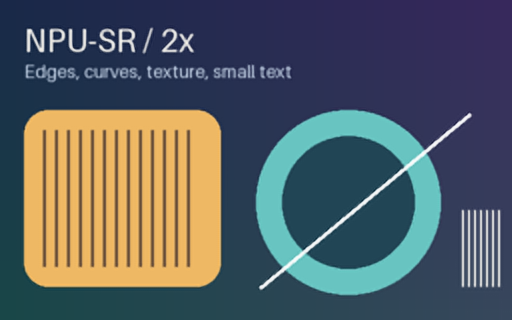
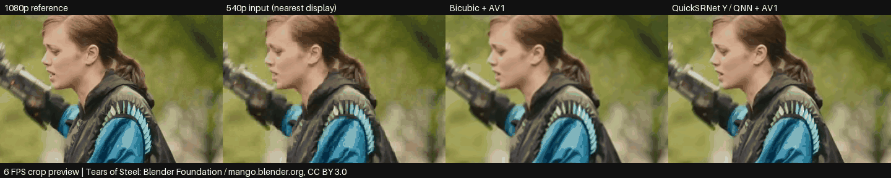
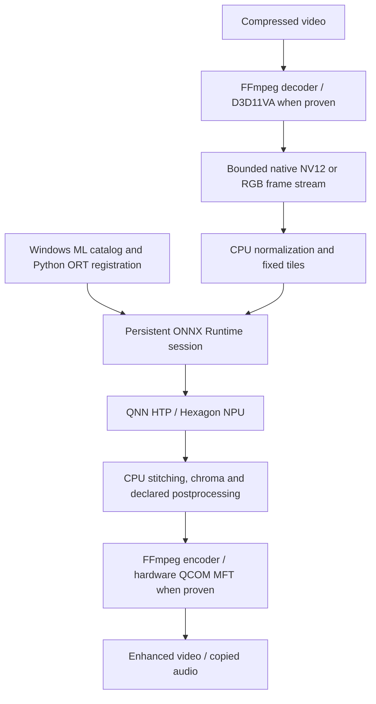

# npu-sr

> practical image and video enhancement on Qualcomm Hexagon NPUs.

[](https://github.com/AKMessi/npu-sr/actions/workflows/ci.yml)

**2× image/video super-resolution and image luminance denoising on Snapdragon X
Windows laptops.** Uses the Hexagon NPU for neural enhancement, with verified
hardware video decode/encode where available. CPU and DirectML GPU comparison
remain available. An NPU is a processor designed to run neural networks efficiently.

This project explores practical local workloads for the NPU, with reproducible
models, strict execution checks and measurements rather than utilization claims.
**The v1 candidate is undergoing final installed-wheel validation.** The latest
published release is [v0.9.0](https://github.com/AKMessi/npu-sr/releases/tag/v0.9.0).
Setup, diagnostics, strict hardware proof and a one-command video preset are included.

**Validated v0.9 baseline: 960×540 → 1920×1080 @ 30 FPS, 53.05 FPS median throughput**,
three independent trials, **678–682 seconds of actual processing each**,
36,000 frames and 432,000 neural calls per trial, zero application drops.
Strict QNN, D3D11VA H.264 decode and QCOM AV1 hardware encoding are verified.
On 24 frozen clips, including twelve originally held out of model selection,
it beats delivered bicubic by **2.00 dB PSNR, 0.00912 SSIM and 5.95 VMAF**
on average. All clips were rechecked without retuning.

See the [v0.9 results](benchmarks/v0.9/summary.md) for every trial, clip, setting,
format limitation and timing scope. AC, Balanced, saver off; other background
processes uncontrolled; power and temperature not measured. These are results
from one laptop and declared inputs, not general Snapdragon performance claims.
Whole function time was 688–693 seconds; the final packet audit took under one
second. `--verify-full` retains the slower decoded-frame forensic audit.

## Results and examples

The included MIT test card and actual QNN outputs:

| Input | Bicubic 2× | ESPCN 2×, QNN NPU |
| --- | --- | --- |
|  |  |  |

Measured v0.5 crops (reference / input / bicubic / QuickSRNet QNN):



This is a 6 FPS preview of the measured 30 FPS outputs; the input is enlarged
with nearest-neighbor sampling for display. Source: *Tears of Steel*, Blender
Foundation / [mango.blender.org](https://mango.blender.org/),
[CC BY 3.0](https://creativecommons.org/licenses/by/3.0/).
Crop, retiming, enhancement and GIF conversion are adaptations.
[Reproduction and attribution](examples/README.md).

Lightweight models sharpen some edges but can ring, blur texture or flicker.
No missing-detail reconstruction or state-of-the-art quality is promised.

The v0.5 delivered-video corpus averages **39.87 dB / 0.97103 SSIM / 91.57 VMAF**
for QuickSRNet Small, versus **37.87 dB / 0.96191 / 85.62** for bicubic, with the
same AV1 hardware encoding. The reference-based temporal residual diagnostic
increases 2.17%; it is a project diagnostic, not a perceptual metric. Per-frame
models can still flicker. The pinned VMAF NEG check also favors the new model.

All results describe one machine, declared models/inputs/settings, and three
performance trials; they are not general Snapdragon claims. Historical reports:
[v0.1](benchmarks/snapdragon-x-plus.json) · [v0.2](benchmarks/v0.2/summary.md) ·
[v0.3](benchmarks/v0.3/summary.md) · [v0.4](benchmarks/v0.4/summary.md) ·
[v0.5](benchmarks/v0.5/summary.md) · [v0.6](benchmarks/v0.6/summary.md) ·
[v0.8](benchmarks/v0.8/summary.md) · [v0.9](benchmarks/v0.9/summary.md).

## Hardware and prerequisites

Target: Snapdragon X Plus / X Elite Windows 11 ARM64, build 26100 (24H2) or newer,
with supported Qualcomm drivers. Only X1P-42-100 is locally verified; see the
[hardware matrix](docs/hardware-matrix.md). Other machines require validation.
CPU image/video processing also works on Linux; generic CI uses CPU only.

Tested locally on 2026-10-05:

| Component | Configuration |
| --- | --- |
| Processor | Snapdragon X Plus X1P-42-100, 8 logical CPUs, 16 GB memory |
| NPU | Qualcomm Hexagon, 45 TOPS; driver 30.0.219.1000 |
| OS / Python | Windows 11 ARM64 build 26200 / Python 3.12.0 ARM64 |
| ONNX Runtime Windows ML | package 1.25.2.202605110140, API 1.25.2 |
| Windows ML / App Runtime | wasdk 2.3.0 / installed runtime 2.5.1.0 |
| QNN catalog package | 2.2480.53.0 |
| GPU | Qualcomm Adreno X1-45, strict DirectML |
| FFmpeg | native ARM64 n9.0.1-11-ge47273f4d9 |

Install native **Python 3.12 ARM64**, the stable **ARM64 Windows App Runtime 2.x
(version 2.3.0.0 or newer)** from Microsoft's [download page](https://learn.microsoft.com/en-us/windows/apps/windows-app-sdk/downloads),
the [VC++ ARM64 redistributable](https://learn.microsoft.com/en-us/cpp/windows/latest-supported-vc-redist),
and current OEM/Windows Update NPU drivers. App Runtime is separate from pip's
Python bindings. Python 3.11–3.13 is allowed; 3.12 ARM64 is locally tested.
No Qualcomm SDK, Visual Studio, copied runtime DLLs or cloud credentials are needed.
Internet is needed for acquisition; inference itself is local.

## Install and quickstart

```powershell
git clone https://github.com/AKMessi/npu-sr.git
cd npu-sr
py -3.12-arm64 -m venv .venv
.venv\Scripts\Activate.ps1
python -m pip install --upgrade pip
python -m pip install -e .
npu-sr setup --download-ffmpeg
npu-sr doctor
npu-sr upscale examples/input.png -o output.png --model quicksrnet-small-y-x2 --device npu
```

If activation is blocked, invoke `.venv\Scripts\python.exe` and
`.venv\Scripts\npu-sr.exe` directly. On Linux use `python3 -m venv .venv` and
`source .venv/bin/activate`. Do not install another ORT wheel alongside
`onnxruntime-windowsml`: the wheels share the same Python import namespace.

Weights remain ignored. Downloads verify source hashes and write an adjacent
ONNX integrity/provenance manifest. Outside the clone, use `NPU_SR_MODEL_DIR` or
acquire models in the user's application cache. See [models](docs/models.md).

For wheel installation and CPU-only Linux, see [installation](docs/installation.md).
Release wheels include setup; no PyPI publication is claimed.
The simplest Windows ARM64 video command is:

```powershell
npu-sr video input.mp4 -o enhanced.mp4
```

This selects the validated realtime model and requires strict NPU and hardware
codec proof. Explicit CPU and historical model options remain available.

### Images and diagnostics

```powershell
npu-sr doctor
npu-sr models list
npu-sr models info fsrcnn-x2
npu-sr models download fsrcnn-x2
npu-sr upscale input.jpg -o output.png --model fsrcnn-x2 --device npu --verbose
npu-sr upscale input.webp -o output.png --device cpu
npu-sr upscale input.png -o output.png --comparison-dir outputs/compare
npu-sr models download dncnn-25
npu-sr denoise noisy.png -o clean.png --device npu
npu-sr benchmark examples/input.png --runs 30 --gpu --json outputs/image.json
npu-sr evaluate low.png high_ground_truth.png --device npu
```

PNG/JPEG/still WebP, EXIF orientation and alpha are handled. SR preserves aspect
ratio and doubles dimensions. DnCNN denoises luminance at the original size,
targeting Gaussian sigma 25/255; it does not remove chroma noise. Quality metrics
require aligned HR/clean references. ICC/metadata and animation are outside scope.

### Video and realtime

```powershell
python scripts/download_ffmpeg.py
npu-sr video input.mp4 -o output.mp4 --preset realtime --json outputs/video.json
npu-sr video input.mp4 -o output.mp4 --preset quality --device npu --codec av1
npu-sr video input.mp4 -o cpu.mp4 --device cpu --decode software --encode software
npu-sr benchmark-video input.mp4 -o outputs/trials --device npu --trials 3 --json outputs/video.json
npu-sr evaluate-video enhanced.mp4 high-reference.mkv --vmaf --json outputs/quality.json
```

The realtime preset materializes documented settings and prints them. Explicit
options override a preset; changed settings do not inherit its benchmark claim.
Audio is copied by default (`--audio none` to disable). MP4/MKV, CFR SDR, square
pixels and even dimensions are supported. HDR, full-range planar video, rotation
and variable framerates require explicit conversion or the documented RGB path.
Existing outputs require `--overwrite`.

FFmpeg is acquired outside git with a pinned hash and separate GPL notices.
`--ffmpeg path/to/ffmpeg` or `NPU_SR_FFMPEG` selects an explicit installation.
Hardware modes require executed-path evidence. Software AV1 selects an installed
SVT-AV1 or libaom encoder. See [FFmpeg](docs/ffmpeg.md), [video pipeline](docs/video-pipeline.md)
and [realtime reproduction](docs/realtime.md).

## Architecture and execution proof



Windows ML installs/discovers QNN and explicitly registers its library in Python's
ORT environment. It is not another inference engine. Fixed-shape, overlapping
tiles discard their receptive-field halo. FP32 ONNX uses QNN HTP FP16 math.
One session remains alive across all video frames; proof and warmups precede timing.

| Device / codec mode | Behavior |
| --- | --- |
| `--device npu` | Requires an NPU hardware device, HTP, disabled CPU fallback and executed QNN kernels |
| `--device gpu` | Requires strict DirectML GPU assignment and executed GPU kernels |
| `--device cpu` | CPUExecutionProvider only |
| `--device auto` | Prefers strict NPU; explicitly reports CPU fallback on initialization failure |
| `--decode/--encode hardware` | Fails if the actual hardware path cannot be established |
| `--decode/--encode auto` | Explicitly reports an unavailable hardware path and chosen software fallback |

Strict proof profiles the **actual session** and rejects CPU/other-provider
kernels. Provider lists alone are not evidence; CPU may still appear in the list.
No midstream fallback occurs. Hardware decode requires D3D11 frames and explicit
hardware download. Encoding requires hardware-only Media Foundation selection,
an activated transform, and validated output counts/cadence. H.264/HEVC/AV1
selected QCOM hardware transforms locally. No internal VPU/NPU utilization is inferred.

Task Manager → Performance → NPU is an external sanity check. `--verbose` reports
initialization evidence. “100% NPU” is not claimed: IO, tiling, chroma, stitching,
transfers and orchestration use CPU. See [QNN](docs/qnn.md) and [architecture](docs/architecture.md).

## Benchmarks, limitations and development

[Benchmark methodology](docs/benchmarking.md) separates startup/proof, inference,
complete-image processing and actual video throughput. [Realtime](docs/realtime.md)
defines the sustained gate, latency scope and settings. All raw release results
are committed without datasets, machine identifiers or private paths.

- Per-frame models have no temporal context; ringing/flicker and content-dependent regressions remain.
- Real-time validation covers a declared 540p workload on one laptop, not arbitrary codecs/resolutions.
- Native NV12 assumes limited-range SDR; RGB remains available for other supported SDR input.
- No zero-copy, GUI, webcam/OBS integration, power measurement or thermal sensor claim.
- Driver/provider updates can change compatibility; proof runs for every new session/cache load.
- Models, FFmpeg, proprietary runtimes and benchmark datasets are acquired separately.

Run `doctor` for missing components. See [troubleshooting](docs/troubleshooting.md), [quality](docs/quality.md),
[hardware codecs](docs/hardware-codecs.md) and [hardware matrix](docs/hardware-matrix.md).

## Roadmap and license

- [x] v0.1: image SR, strict Qualcomm NPU, CPU benchmark, diagnostics
- [x] v0.2: improved models, denoising, tiled inference, strict GPU comparison, quality suite
- [x] v0.3: in-memory video, FFmpeg, proven hardware decode/encode, audio and output validation
- [x] v0.4: sustained realtime video, bounded pipeline, measured quality/speed tradeoffs
- [x] v0.5: expanded quality corpus, QuickSRNet, improved delivered quality
- [x] v0.6: cheaper default validation and CPU/memory profiling
- [x] v0.8: packaged installation, executed diagnostics and user presets
- [x] v0.9: long-run reliability, audio/cadence and format validation
- [ ] v1.0: final installed-wheel release validation
- [ ] Temporal model: researched, quality gate not passed; remains outside defaults
- [ ] Future: temporal models, live sources, perceptual preprocessing, further codec/NPU experiments

Our code is [MIT](LICENSE). ESPCN/FSRCNN/LapSRN upstream weights are Apache-2.0;
KAIR DnCNN is MIT; Qualcomm QuickSRNet checkpoints are BSD-3-Clause.
Weights are not committed. Microsoft, Qualcomm and FFmpeg
retain their own terms. See [THIRD_PARTY_NOTICES.md](THIRD_PARTY_NOTICES.md).

[Contributing](CONTRIBUTING.md) · [security reporting](SECURITY.md)

```powershell
python -m pip install -e ".[dev]"
python -m ruff check .
python -m ruff format --check .
python -m pytest
python -m pytest -m npu
python -m pytest -m video_hw
python -m build
```

Ordinary CI needs no NPU. Hardware tests and sustained benchmarks run locally.
