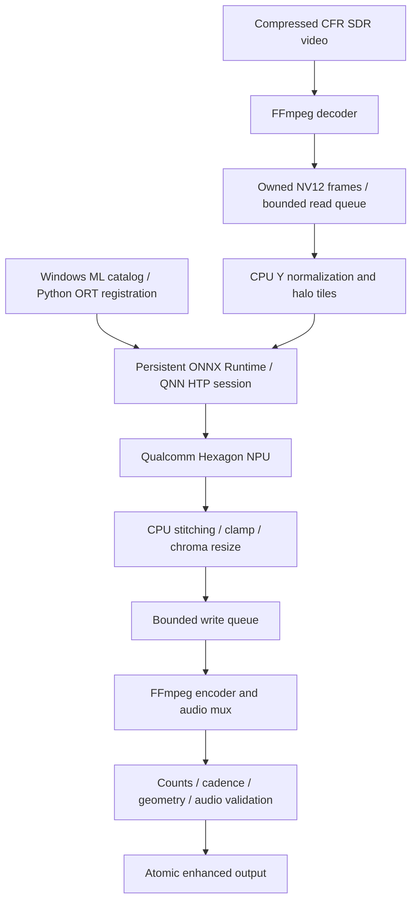

# Architecture

Windows ML installs/registers the provider before ORT session creation; it does
not perform a second inference pass. Decoder/encoder are labeled hardware only
when their executed proofs pass. Current primary profile uses D3D11VA H.264 and
QCOM AV1 Media Foundation. NV12 is downloaded to system memory, not zero-copy.

## Modules

| Responsibility | Module |
|---|---|
| CLI and errors | `cli.py`, `errors.py`, `progress.py` |
| Installation and capability proof | `setup.py`, `install_ffmpeg.py`, `capabilities.py`, `diagnostics.py` |
| Model contracts/provenance/export | `model.py`, `acquire.py`, `acquire_models.py`, `quicksr.py` |
| Windows ML/QNN bootstrap | `qnn.py` |
| Strict runtime, GPU proof, context integrity | `runtime.py`, `gpu.py`, `cache.py` |
| Images and tiles | `image.py` |
| Video decoding/encoding, pipe framing/cleanup | `ffmpeg.py` |
| Video orchestration, presets, frame processing | `video.py`, `planar.py` |
| Bounded ordered frame stream | `stream.py` |
| Counts/timestamps, optional forensic audit | `video_validation.py` |
| Timing/resources/power states | `video_stats.py`, `monitoring.py` |
| Benchmarks and quality | `benchmark.py`, `suite.py`, `video_benchmark.py`, `video_quality.py`, `quality_gate.py` |
| Experimental temporal state/export | `temporal.py`, `temporal_model.py`; not the default |

Reader and writer threads overlap codec IO. The main thread owns the model input
and runs ORT synchronously; there is no concurrent submission on a single QNN
session. Owned complete frame bytes cross depth-two FIFO queues. Tile tensors
are consumed before their reusable buffers change. Callback indices are checked
against sequential frame order; all expected neural calls and encoded frames
must match before output is published.

## Contracts

Model registry entries supply task/scale/core/halo/color/precision and static
input/output shapes. Halo outputs are discarded, exterior edges repeat pixels,
and partial tiles are padded/cropped. One compilation serves every frame size via
tiles. No image resizing to a fixed arbitrary model canvas or bypassed SR exists.

The default video model is QuickSRNet Small neutral Y, core256/halo4/input264²,
FP32 ONNX and QNN HTP FP16 math. NV12 uses limited-range Y16–235 and bicubic UV.
Image commands retain the original ESPCN default and full-range Rec.601-style
luminance/chroma reconstruction, alpha handling and exact 2× dimensions.
See [models](models.md), [image path](image-pipeline.md), [video path](video-pipeline.md).

Strict NPU disables ORT CPU fallback, selects an NPU device plus HTP backend,
runs proof on the actual session and requires exclusively QNN executed kernels.
Every cache load repeats proof. Auto may create a new explicitly reported CPU
session on initialization failure; no midstream backend switch occurs.
[QNN details](qnn.md). IO, transfers and orchestration remain CPU work.

Default file validation inspects bounded reordered packet PTS/counts, compares
actual pipeline frames, dimensions, cadence, duration and copied audio, then
renames an owned temporary output atomically. Packet counts alone do not prove
pixel integrity; `--verify-full` decodes every frame again under a timeout.
Full-file seeking/count validation belongs to the file adapter; the sequential
`Frame` stream does not require a known length, enabling future live adapters.
No live source/player is implemented. [Codec evidence](hardware-codecs.md).
