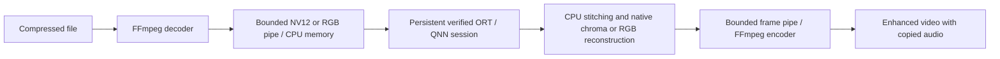

# Video pipeline



The video pipeline handles constant-framerate, square-pixel SDR video with positive even
dimensions. It preserves input framerate and processes every decoded frame in
order. HDR, rotation metadata, anamorphic input and detected variable framerates
fail with an explanation. Convert those explicitly before enhancement. No
webcam, seeking, GUI, or frame-rate conversion is exposed in this release.

One model/session lives for the whole file. Strict assignment/profiling happens
at initialization; three tensor warmups follow. Image preprocessing and tiling
are reused. Frames are not written to PNG files. The default remains sequential RGB processing. v0.4 adds native NV12 buffers and
bounded reader/writer queues (depth 0–4); preset depth 2 overlaps decode, neural
enhancement and encode. One worker owns the model and reusable tensors. Each
queued frame owns its bytes. Pipes and queues apply backpressure; diagnostics,
timing and resource samples have fixed bounds.

The output is written to a unique sibling temporary file. Success requires:

- Decoder and encoder both finish successfully.
- Hardware format/MFT evidence when requested, and strict neural execution proof.
- Encoded frame count equals the number processed; metadata count and source
  duration are checked when available.
- Resolution is exactly twice the input, with the same framerate and expected duration.
- Every packet presentation timestamp retains CFR cadence after bounded coded-order
  reordering, and packet count agrees with actual processed frames.
- `--verify-full` instead audits every decoded-frame timestamp and count.
- Copied audio survives when the source has audio.

Only then is the output published. An existing output requires `--overwrite`;
the input cannot be overwritten. Ctrl+C or a failure terminates both processes
and removes the partial output. A 60-second inactivity watchdog kills stalled
children to unblock pipes. Audio copy uses the first audio stream; unsupported
container/codec combinations fail rather than silently reencoding. Subtitles,
chapters and source metadata are not carried over.

Typical command:

```powershell
npu-sr video input.mp4 -o output.mp4 --model espcn-x2-256 --device npu --decode hardware --encode hardware --codec av1 --bitrate 8M --json outputs/video.json
```

`--device cpu`, `--decode software` and `--encode software` permit explicit
comparisons. `auto` announces each unavailable hardware fallback. Strict modes
never fallback. Midstream errors are failures, including after a successful probe.

Timing covers decoder process start through encoder flush, including transfer,
preprocessing, neural calls, reconstruction and pipe waits. Model/provider
initialization, codec probes, final validation and hashing are separate from
processing time. Pipe waits are not isolated codec compute measurements.
End-to-end FPS is processed frames divided by that complete processing interval.
Real-time factor is processing seconds divided by processed source duration;
less than one is faster than real time. A short fast clip does not establish
sustained real-time performance.

See [FFmpeg evidence](ffmpeg.md) and [benchmarking](benchmarking.md).


The realtime preset chooses a declared native-Y path and fixed neural strength;
explicit overrides do not inherit its measured performance claim. First/final/
minimum rolling throughput and queue depth supplement actual complete-video FPS.
Frame handoff latency ends at encoder pipe submission, not display or encoder
completion. See [realtime](realtime.md) for settings, gates and reproducibility.

## Validation modes (v0.6)

Default input/output checks inspect all video packet timestamps and durations,
not just nominal framerate. The bounded reorder heap handles codec B-frames.
Bad flags, malformed PTS, duplicates, gaps or excessive reordering fail. Packet
counts must agree with decoded/processed frame accounting; output resolution,
framerate, duration, audio and successful encoder flush are still required.
Strict QNN proof, hardware evidence and every expected neural tile call remain.

Packet count is not universally decoded-frame count. Unusual packet layouts
require `--verify-full`, and packet inspection cannot prove decoded pixel integrity.
The full mode decodes every frame again and may be much slower. Both modes
retain atomic output publication and cleanup on errors; neither accepts VFR.

```powershell
npu-sr video input.mp4 -o enhanced.mp4 --preset realtime
npu-sr video input.mp4 -o audited.mp4 --preset realtime --verify-full
```
